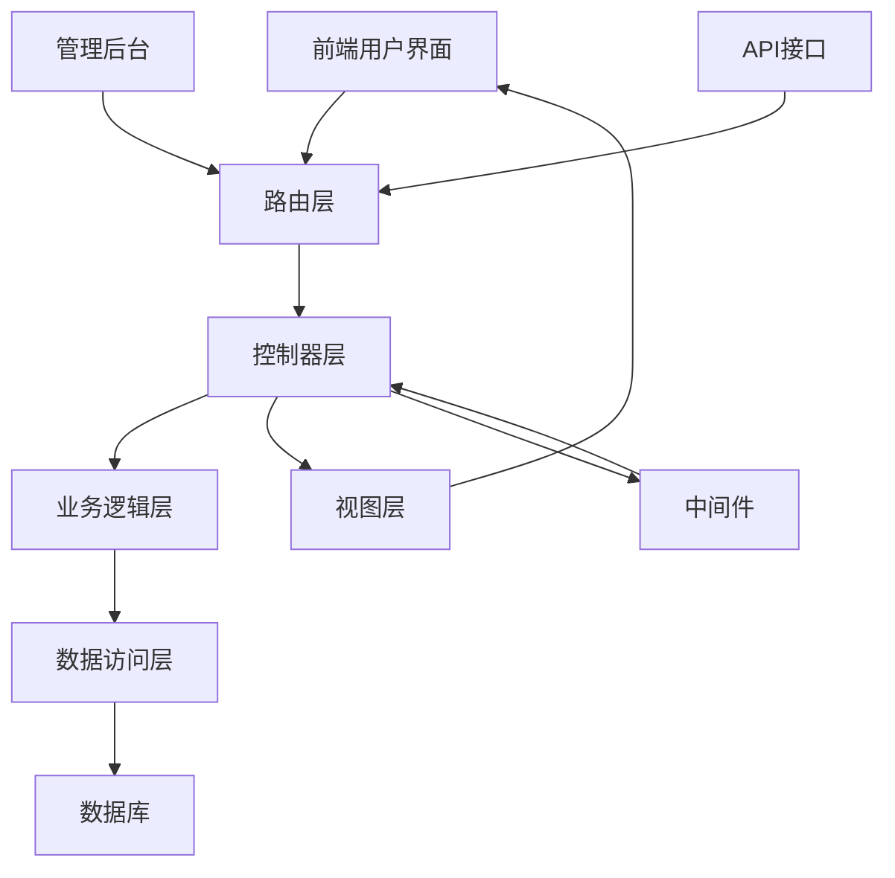
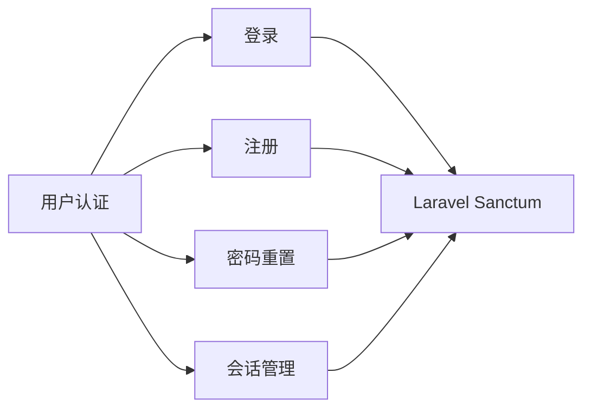
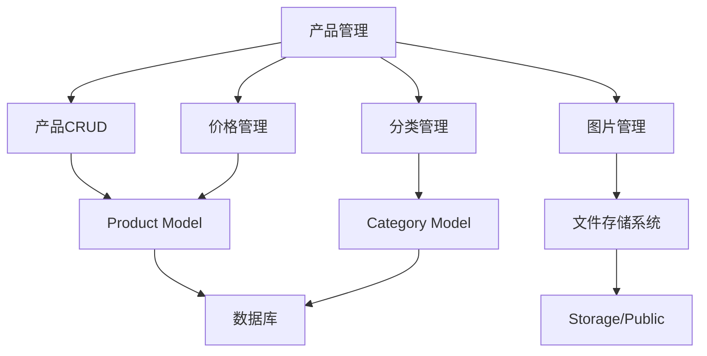
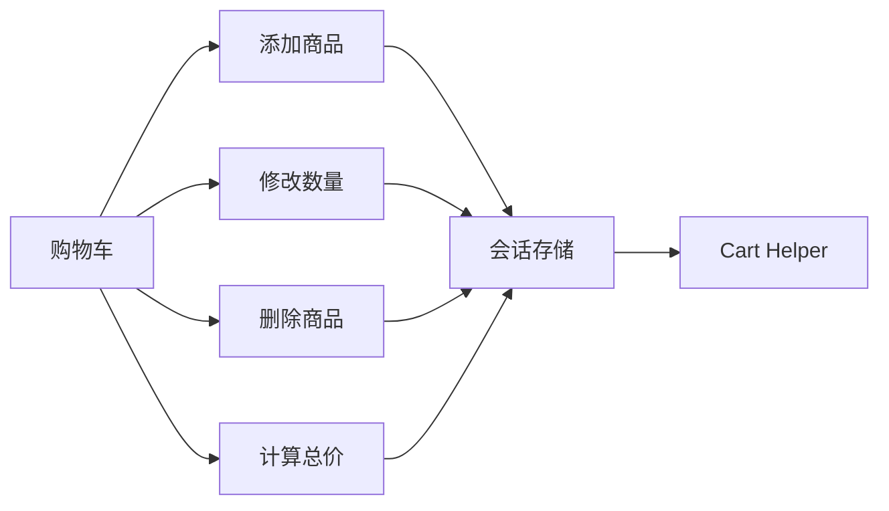
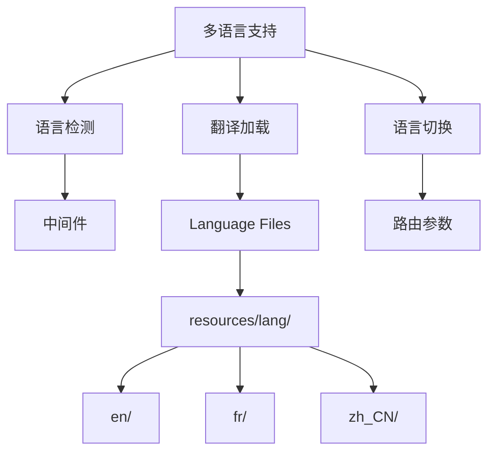
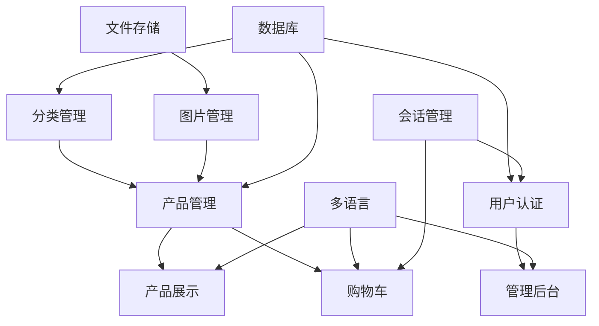
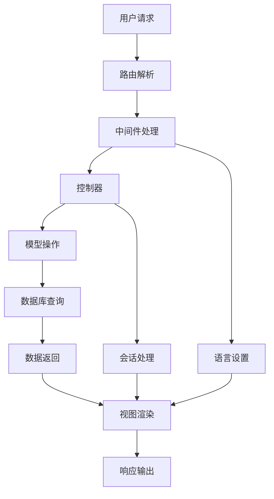
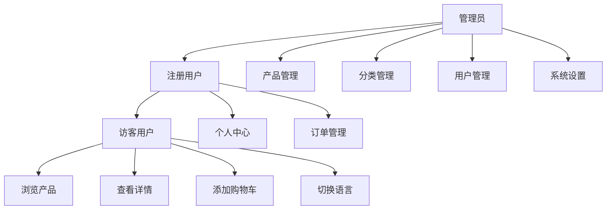
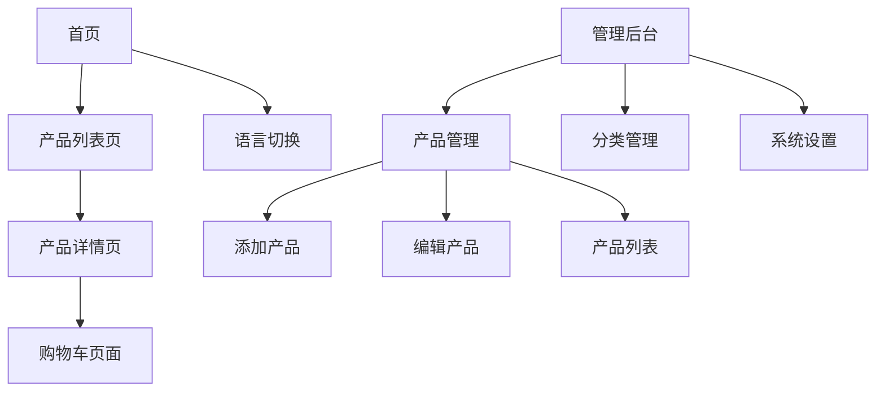
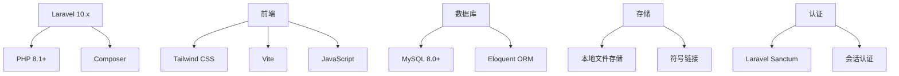

# BJW Laravel E-commerce 功能地图

## 系统架构概览



## 核心功能模块

### 1. 用户认证系统


**相关文件**:
- `app/Http/Controllers/Auth/`
- `resources/views/auth/`
- `config/auth.php`

### 2. 产品管理系统


**相关文件**:
- `app/Models/Product.php`
- `app/Models/Category.php`
- `app/Http/Controllers/Admin/ProductController.php`
- `resources/views/admin/products/`

### 3. 购物车系统


**相关文件**:
- `app/Http/Controllers/Frontend/CartController.php`
- `resources/views/frontend/cart/`
- 会话存储机制

### 4. 多语言系统


**相关文件**:
- `resources/lang/`
- `app/Http/Middleware/LocaleMiddleware.php`
- `routes/web.php`

## 功能依赖关系图



## 数据流图



## 用户角色权限图



## 前端页面结构



## 技术栈依赖



## API接口结构

```mermaid
graph LR
    A[API Routes] --> B[产品API]
    A --> C[购物车API]
    A --> D[认证API]
    
    B --> E[GET /products]
    B --> F[GET /products/{id}]
    
    C --> G[POST /cart/add]
    C --> H[PUT /cart/update]
    C --> I[DELETE /cart/remove]
    
    D --> J[POST /login]
    D --> K[POST /logout]
```

## 功能优先级矩阵

| 功能模块 | 重要性 | 复杂度 | 状态 | 依赖模块 |
|----------|--------|--------|------|----------|
| 产品展示 | 高 | 中 | ✅ 完成 | 产品管理、多语言 |
| 购物车 | 高 | 中 | ✅ 完成 | 产品展示、会话 |
| 用户认证 | 高 | 低 | ✅ 完成 | - |
| 产品管理 | 高 | 高 | ✅ 完成 | 认证、文件上传 |
| 多语言 | 中 | 中 | ✅ 完成 | - |
| 分类管理 | 中 | 低 | ✅ 完成 | 认证 |
| 订单系统 | 高 | 高 | 🔄 计划中 | 购物车、支付 |
| 支付集成 | 高 | 高 | 🔄 计划中 | 订单系统 |
| 库存管理 | 中 | 中 | 🔄 计划中 | 产品管理 |
| 评论系统 | 低 | 中 | 📋 待定 | 用户认证 |

## 集成点

### 外部服务集成
- **支付网关**: 待集成
- **邮件服务**: Laravel Mail
- **短信服务**: 待集成
- **物流接口**: 待集成

### 内部服务通信
- **缓存系统**: File Cache (可升级到Redis)
- **队列系统**: Database (可升级到Redis)
- **日志系统**: Laravel Log
- **文件存储**: Local Storage (可升级到云存储)

## 性能关键路径

1. **产品列表加载**: 数据库查询 → 图片URL生成 → 视图渲染
2. **购物车操作**: 会话读取 → 数据验证 → 会话写入
3. **图片显示**: 文件系统访问 → 缓存检查 → 响应输出
4. **多语言切换**: 语言文件加载 → 会话更新 → 页面刷新

## 扩展性考虑

### 水平扩展点
- 产品分类可支持多级分类
- 购物车可升级为持久化存储
- 多语言可增加更多语种
- 支付可集成多个网关

### 垂直扩展点
- 数据库可分库分表
- 静态资源可使用CDN
- 缓存可升级为分布式缓存
- 搜索可集成Elasticsearch

## 监控和分析

### 关键指标
- 页面加载时间
- 数据库查询性能
- 用户转化率
- 错误发生率

### 日志分类
- 访问日志
- 错误日志
- 业务日志
- 性能日志

这个功能地图为项目的整体架构和功能关系提供了清晰的可视化展示，有助于团队理解系统设计和规划未来开发。

